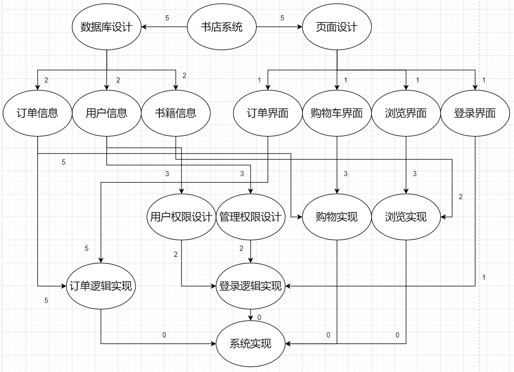

# 2023-3-21会议纪要

## 内容概要

* XP开发方法
* DevOps
* 项目活动图

## 主要内容

### XP开发方法

* 主要流程
  包含阶段：规划游戏->迭代开发->频繁发布
  在每个开发周期中，开发者首先探索需求，制定计划，然后实施计划，进行实现并对计划进行补充，同时测试和发布，  然后进入下一个开发周期，每一个循环最多三周。
  在规划阶段，团队根据客户提出的用户故事，确定当前版本要实现的功能，并根据开发进度实时调整开发计划。
  在开发阶段，XP开发要求任务从分析到实现逐步完成，先完成测试样例再实现功能代码，实现由测试驱动；同时项目持续集成，代码在修改后立刻集成，减少冲突；项目采取结对编程，协作开发，团队成员共同维护代码库。
* 设计原则

  每次设计简单的功能，避免过度设计，并自迭代开发中不断重构改进代码。每次小型发布，不断收集用户反馈来调整下一阶段的开发计划。
* 优点

  XP开发能够快速响应变化，使客户可以随时调整需求。通过测试驱动开发和持续重构，使代码结构更清晰，获得更高质量的可读性高的代码。通过频繁交付功能，快速发现并解决问题。
* XP的规则：

  * 管理规则：
    * 指标采用负载因子和功能测试的通过率
    * 团队角色分为客户、开发者、Coach、测试者和跟踪者
    * 工作环境上：所有团队成员共用Bullpen，便于协作和交流
    * 通过每日站会讨论进展和问题
  * 开发规则：
    * 使用开发周期：任务从分析到实现的过程，包含单元测试和代码集成
    * 持续集成：每次代码修改后立即集成，减少代码冲突
    * 集体代码所有权：团队成员共同维护代码库，任何人均可修改代码
    * 结对编程：两个开发者协作开发，一个负责编码，另一个实时审查
  * 设计规则：
    * 最简单可行方案DTSTTCPW：实现当前所需最简单功能，避免过度设计
    * 不做未来用不到的事YAGNI：仅实现当前需求，避免实现未来可能用到的功能
    * 无情重构：小步改进优化代码结构，使系统简单易懂
  * 测试规则：
    * 单元测试：开发者为代码编写自动化测试，确保每个单元正常运行
    * 功能测试：客户编写黑盒测试，验证功能是否符合需求

### DevOps

##### DevOps 的核心定义：

    简单地来说，DevOps 就是更好的优化开发(DEV)、测试(QA)、运维(OPS)的流程，开发运维一体化，通过高度自动化工具与流程来使得软件构建、测试、发布更加快捷、频繁和可靠。

    DevOps是一种思维模式：
			文化：心灵与思想拥抱变革。
			自动化：基础设施即代码。
			精益化：专注于最终用户，小批量生产。
			指标化：度量衡量一切展示进步。
			合作化：共享协作，开放信息共享。

- 业务方、开发团队、运维团队和质量保障团队通过协作，以持续、稳定的方式交付软件。
- 强调跨部门共享业务目标、任务和共同理念，打破传统孤岛。
- 通过工具链和文化变革，加速 IT 服务的响应和交付效率。
- 通过自动化（CI/CD）、监控、基础设施即代码（IaC）等实践，确保软件交付的速度与稳定性。

##### Devops 的好处与价值：

    1、代码的提交直接触发：消除等待时间，快速反馈
		2、每个变化对应一个交付管道：使问题定位和调试变得简单
		3、全开发流程高效自动化：稳定，快速，交付结果可预测
		4、持续进行自动化回归测试：提升交付质量
		5、设施共享并按需提供：资源利用最大化

##### Devops与持续集成：

    DevOps 是一个完整的面向IT运维的工作流，以 IT 自动化以及持续集成（CI）、持续部署（CD）为基础，来优化程式开发、测试、系统运维等所有环节。
		DevOps Tools 的技术关键点:

    1.Automated infrastructure（自动化，系统之间的集成）

    2.shared version control（SVN共享源码）

    3.one step build and deploy（持续构建和部署）

    4.feature flags（主干开发）

    5.Shared metrics（共享指标）

    6.IRC and IM robots（信息整合）

##### DevOps 的技术栈与工具链：

    DevOps 同样要通过技术工具链完成持续集成、持续交付、用户反馈和系统优化的整合，包括版本控制&协作开发工具、自动化构建和测试工具、持续集成&交付工具、部署工具、维护工具、监控，警告&分析工具等。

    例如：

    版本控制&协作开发：GitHub、GitLab、BitBucket等。

    自动化构建和测试:Apache Ant、Maven 、Selenium、等。

    持续集成&交付:Jenkins、Capistrano、BuildBot、Fabric等。

    容器平台: Docker、Rocket、Ubuntu（LXC）、第三方厂商如（AWS/阿里云）等。

    配置管理：Chef、Puppet、CFengine、Bash等。

    微服务平台：OpenShift、Cloud Foundry、Kubernetes等。

    服务开通：Puppet、Docker Swarm、Vagrant等。

    日志管理：Logstash、CollectD、StatsD等。

    监控，警告&分析：Nagios、Ganglia、Sensu等。

### 项目活动图

#### 1、书上练习题关键路径：

习题2：A-B-D-I-J-L

| 顶点 | A | B | C | D | E | F  | G  | H  | I  | J  | K  | L  |
| ---- | - | - | - | - | - | -- | -- | -- | -- | -- | -- | -- |
| Ve   | 0 | 3 | 5 | 8 | 4 | 8  | 7  | 10 | 10 | 12 | 14 | 20 |
| Vl   | 0 | 3 | 9 | 8 | 7 | 12 | 10 | 13 | 10 | 12 | 17 | 20 |

习题3：A-B-C-E-F-I-K-L

| 顶点 | A | B | C | D | E  | F  | G  | H  | I  | J  | K  | L  |
| ---- | - | - | - | - | -- | -- | -- | -- | -- | -- | -- | -- |
| Ve   | 0 | 2 | 5 | 4 | 10 | 13 | 7  | 12 | 18 | 20 | 22 | 24 |
| Vl   | 0 | 2 | 5 | 9 | 10 | 13 | 12 | 21 | 18 | 23 | 22 | 24 |

#### 2、书店系统项目活动图

