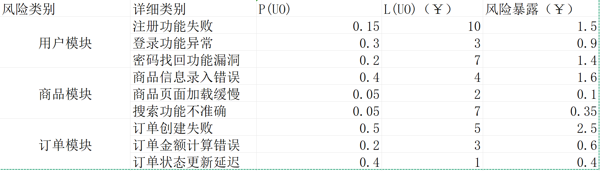

# 2025-4-11会议纪要

## 内容概要

1. 工作量估算
2. 风险管理
3. 学习软件需求规格说明SRS文档的要求和结构

## 主要内容

### 1.工作量估算

#### 1.1 习题12讨论：

    代码行数作为单一生产率指标存在严重缺陷，需结合技术栈特性、项目阶段和团队目标选择多维度量体系。 核心原则是：度量应服务于价值交付，而非形式化考核 。而实现的应用点在这种情况下会好一些，应该丰富多种多维评价体系，而非使用单一指标进行评价。

##### 不同编程语言对生产率的测度的影响

    不同的编程语言的抽象层级和语言特性导致实现相同功能的代码量差异显著，如使用Python等动态语言可能10行代码完成的功能使用C++可能需要50行，这样在跨团队或跨项目比较时，代码行数会扭曲生产率评估。例如，使用Python的团队可能因代码量少被误判为低效，而C++团队则可能因冗长代码获得虚高评价。可以改用基于实现功能点复杂性及其可维护性指数、单元测试覆盖率等进行评价。

##### 开发前期工作对生产率测度的影响

    在需求分析、架构设计等前期阶段，尚未产生可执行代码，无法直接使用代码行数作为度量依据。若仅依赖历史代码行数数据，可能导致对前期工作的工时低估。这会导致文档编写和接口设计等重要工作被忽视。可以改用关键节点或里程碑测度等，将文档编写、接口设计、设计评审、架构验证等非编码任务纳入关键节点。

##### 编程人员对代码行数的过分追求对生产率测度的影响

    当代码量成为考核指标时，程序员可能通过添加不必要的条件分支、重复逻辑等方式添加冗余代码；可能拒绝重构代码，因为这可能会减少旧代码的总行数；可能会使用低效的实现方式。这些行为会使代码行数也就是这种测度方式下的工作量大大提高，但大大降低了代码质量，使代码的可维护性和可读性大大降低。可以引入代码质量和代码审查等工作以减少这种行为对生产的影响。

#### 1.2 估算项目的初始工作量：

##### **确定功能点（Function Points, FP）**

统计功能点如下：

| **功能类型**              | **数量** | **复杂度权重** | **计算值** |
| ------------------------------- | -------------- | -------------------- | ---------------- |
| 用户输入（Input）               | 8              | 低（3）              | 8×3=24          |
| 用户输出（Output）              | 5              | 中（4）              | 5×4=20          |
| 用户查询（Inquiry）             | 6              | 低（3）              | 6×3=18          |
| 数据文件（File）                | 4              | 高（7）              | 4×7=28          |
| 外部接口（Interface）           | 3              | 中（5）              | 3×5=15          |
| **总未调整功能点（UFP）** |                |                      | **105**    |

- **调整因子（VAF）**：根据系统特性（如分布式处理、性能要求等），假设调整因子为 1.2。
- **调整后功能点（FP）**：FP=UFP×VAF=105×1.2=126FP

##### **评估规模因子（Scale Factors, SF）**

早期设计模型包含 7 个规模因子，需根据项目特性评分（等级：极低、低、标称、高、极高），并转换为指数值：

| 规模因子             | 等级 | 指数值 | 说明                 |
| -------------------- | ---- | ------ | -------------------- |
| 先例性（PREC）       | 高   | 2.48   | 团队有类似项目经验   |
| 开发灵活性（FLEX）   | 中   | 3.04   | 需求有一定变更容忍度 |
| 体系架构风险（RESL） | 中   | 4.24   | 架构设计较完善       |
| 团队凝聚力（TEAM）   | 高   | 2.19   | 协作良好             |
| 过程成熟度（PMAT）   | 中   | 4.68   | CMMI 3 级            |
| 项目复杂度（CPLX）   | 高   | 5.65   | 涉及广告调度算法     |
| 文档需求（DOCU）     | 标称 | 3.00   | 文档要求适中         |

**总 SF 调整系数**：
	SF=0.91+0.01×∑指数值=0.91+0.01×(2.48+3.04+4.24+2.19+4.68+5.65+3.00)=1.2228

##### **评估工作量乘数（Effort Multipliers, EM）**

早期设计模型包含 7 个关键工作量乘数，假设值如下：

| 工作量乘数         | 等级 | 值   | 说明                  |
| ------------------ | ---- | ---- | --------------------- |
| 产品复杂度（CPLX） | 高   | 1.34 | 广告调度逻辑复杂      |
| 人员能力（PCAP）   | 高   | 0.71 | 团队技术熟练          |
| 平台难度（PDIF）   | 中   | 1.10 | 云平台与第三方API集成 |
| 工具支持（TOOL）   | 高   | 0.82 | 使用现代化工具链      |
| 需求稳定性（RUSE） | 低   | 1.15 | 需求可能变更          |
| 进度压力（SCED）   | 标称 | 1.00 | 无额外压缩            |
| 复用程度（DATA）   | 中   | 0.90 | 部分复用现有模块      |

**总 EM 调整系数**：
	EM=1.34×0.71×1.10×0.82×1.15×1.00×0.90≈0.78

##### **计算初始工作量（PM）**

代入公式：
	PM=2.94×(6.68)0.91×1.2228×0.78≈2.94×5.87×1.2228×0.78≈16.5 人月

##### **结果分析与调整**

- **估算结果**：16.5 人月（约 363 人天，按 22 人日/月计算）。
- **与甘特图对比**：甘特图总人天为 181 人天（8.23 人月），差异主要源于：
  1. **规模假设不同**：若实际代码量更低（如 3 KSLOC），PM ≈ 8.2 人月，与甘特图一致。
  2. **并行开发未计入**：甘特图可能未体现并行任务的人力叠加。
  3. **参数校准偏差**：团队效率或工具支持可能优于假设值。

## 2.风险管理

**一、风险评估**

1. **风险识别**

   **(1) 检查清单：**

   ​	技术风险：缺乏必要的技术经验、技术选型不当、系统集成问题。

   ​	进度风险：开发周期过长、任务估算不准确、团队成员时间冲突。

   ​	资源风险：资金不足、服务器资源不足、开发工具/软件不足。

   ​	人员风险：团队成员流失、团队合作不畅、关键人员依赖。

   ​	第三方风险：支付/物流接口不稳定、第三方服务费用超支。

   ​	法律风险：侵犯知识产权、数据隐私泄露、违反相关法规。

   **(2) 分解：** 将项目分解为更小的任务和模块，识别每个部分可能存在的风险。例如：

   ​	用户模块：注册功能失败、登录功能异常、密码找回功能漏洞。

   ​	商品模块：商品信息录入错误、商品图片加载缓慢、搜索功能不准确。

   ​	订单模块：订单创建失败、订单金额计算错误、订单状态更新延迟。

   **(3) 对假设的分析：** 识别项目中的关键假设，并分析其不确定性带来的风险。例如：

   ​	假设用户量增长迅速，如果用户量远低于预期，可能导致服务器资源浪费。

   ​	假设所有团队成员都能按时完成任务，如果有人延期，可能导致项目整体延期。

   **(4) 决策驱动因素分析：** 分析项目中的关键决策点，并识别可能影响决策结果的风险。例如：

   ​	选择支付接口：如果选择了不稳定的支付接口，可能导致用户支付失败率升高。

   ​	确定开发框架：如果选择了不熟悉的框架，可能导致开发效率低下。

2. **风险分析**

   **(1) 系统动态性：** 分析系统复杂性和变化带来的风险。例如，微服务架构的复杂性可能导致集成和维护困难。

   **(2) 性能模型：** 评估系统在高负载下的性能表现，识别潜在的性能瓶颈。例如，数据库性能不足可能导致系统崩溃。

   **(3) 成本模型：** 估算项目成本，并分析可能导致成本超支的因素。例如，服务器费用超出预算、第三方服务费用上涨。

   **(4) 网络分析：** 分析网络环境对系统的影响，识别潜在的网络风险。例如，网络延迟可能影响用户体验。

   **(5) 决策分析：** 使用决策树、敏感性分析等方法，评估不同决策方案的风险和收益。

   **(6) 定量风险因素分析：** 对识别出的风险进行量化分析，例如，使用概率分布来描述风险发生的可能性和影响。

3. **风险优先级分配**

   **(1) 风险暴露：** 根据风险发生的概率和影响，计算风险暴露值，并据此确定风险的优先级。

   ​	  风险暴露 = 风险发生的概率 * 风险的影响

   

   **(2) 复合风险降低：** 综合考虑多个风险之间的相互影响，以及不同风险降低措施的效果，确定最优的风险应对策略。

**二、风险控制**

1. **风险降低**

   **(1) 购买信息：** 收集更多关于项目的信息，以降低不确定性。例如，进行市场调研以更准确地预测用户需求。

   **(2) 风险避免：** 采取措施避免某些风险的发生。例如，选择成熟稳定的技术栈，避免使用过于前沿的技术。

   **(3) 风险转移：** 将风险转移给其他方承担。例如，购买第三方服务时，签订明确的SLA（服务水平协议）。

   **(4) 风险降低杠杆：** 评估不同风险降低措施的成本和效果，选择性价比最高的方案。

   **(5) 开发过程：** 采用敏捷开发方法，尽早发现和解决问题。

2. **风险管理计划**

   **(1) 风险要素计划：** 为每个识别出的风险制定详细的应对计划，包括负责人、时间表、预算和具体措施。

   **(2) 风险计划集成：** 将风险管理计划融入到项目整体计划中，确保风险管理活动与其他项目活动协调一致。

3. **风险化解**

   **(1) 风险减轻：** 实施风险应对计划，减轻风险带来的负面影响。

   **(2) 风险监控和报告：** 定期监控风险状态，并向项目干系人报告风险情况。

   **(3) 风险重新评估：** 在项目过程中，根据新的信息和变化，定期重新评估风险，并更新风险管理计划。

### 3.学习软件需求规格说明SRS文档的要求和结构
