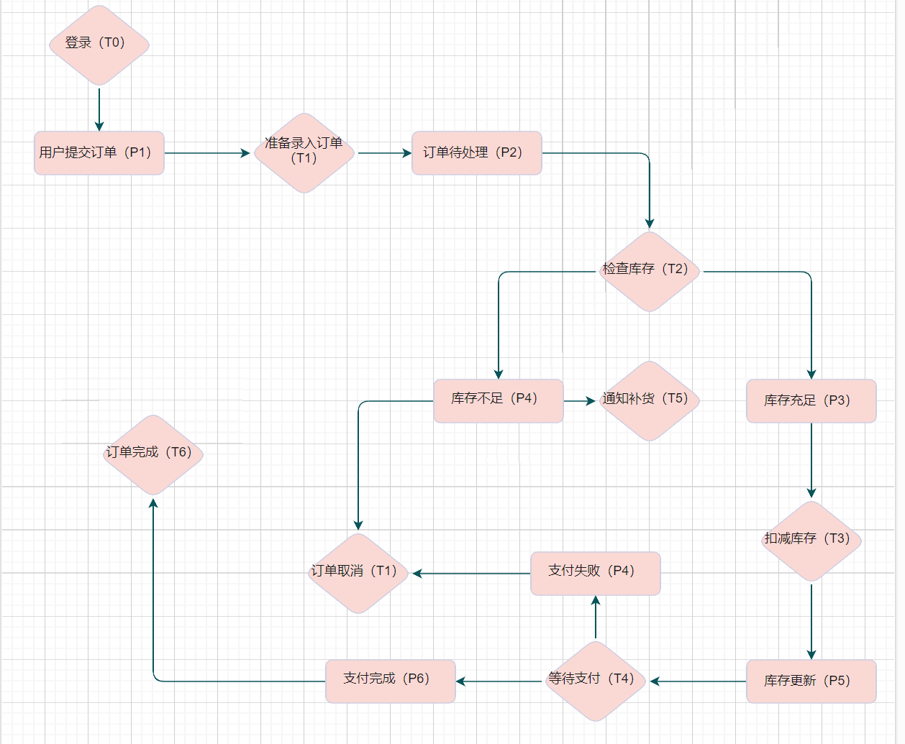
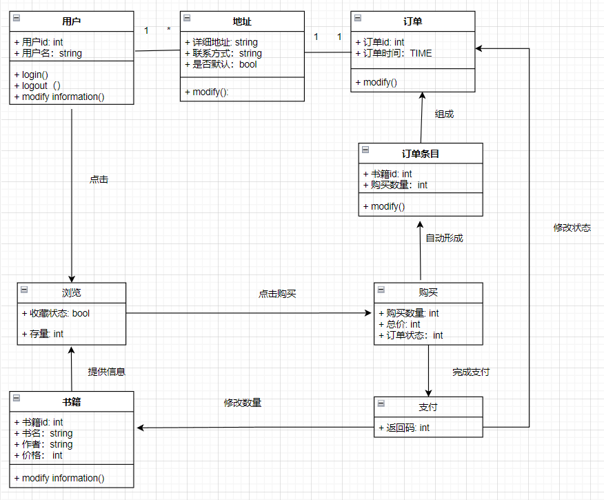

# 2025-4-25会议纪要

## 内容概要

1.学习Petri网基本知识及如何应用Petri网建模

2.练习用各种动态建模工具对所负责的项目进行建模

3.完善自己项目的SRS

## 主要内容

### 1.Petri网基本知识与应用

#### 1. Petri网基本要素

**库所 (Place)**：一般用圆圈表示，刻画系统的状态或资源条件；带有标记（token）表示该条件或资源的可用数量。

**变迁 (Transition)**：一般用矩形或实线条表示，刻画事件或活动的发生。

**弧 (Arc)**：有向连线，连接库所与变迁，定义输入 (Input) 和输出 (Output) 关系。

**令牌（Token）**：是库所中的动态对象，可以从一个库所移动到另一个库所。

**规则**：当一个变迁所有输入库所均有token时，该变迁被使能；使能变迁可触发 (firing)，触发时从每个输入库所移除一个token，并在每个输出库所放入一个token。

#### 2. 典型建模模式

**并行/并发 (Concurrency)**：多个使能变迁相互独立，可同时发生。

**同步 (Synchronization)**：设定一个变迁需多个输入都具备token才能触发，实现多个活动的汇合。

**有界资源 (Limited Resources)**：缓冲区容量建模，使用一个库所跟踪可用位置，另一库所跟踪已占位置。

**顺序 (Sequentiality)**：生产者/消费者问题，用库所区分生产就绪、消费就绪、缓冲状态；变迁依次触发。

**互斥 (Mutual Exclusion)**：共享资源建模，通过冲突 (冲突变迁竞争token) 或抑制弧、优先级实现访问串行。

#### 3. Petri网的性质分析

**可达性 (Reachability)**：通过可达图或可达树，检查系统可能状态及死锁。

**有界性 (Boundedness)**：系统状态空间是否有限，判断缓冲或队列是否可能无限增长。

**活性 (Liveness)**：无死变迁，系统永远不会因某变迁永久不能触发而卡死。

**守恒 (Conservation)**：token总数是否恒定，检测资源总量是否保持不变。

#### 4. 定时与随机Petri网

**定时Petri网 (TPN)**：在变迁上附加时间延迟，常见有确定性延迟或随机延迟 (指数分布)。

**随机Petri网 (SPN)**：采用指数分布延迟，将Petri网映射为连续时间齐次马尔可夫链 (CTMC)，标记即马尔可夫链状态。

**GSPN (Generalized SPN)**：区分即时变迁 (zero-time) 与定时变迁，并在马尔可夫链中消除零时态点。

#### 5. 应用流程

1. **系统分析**：识别系统组件、状态、事件及资源；明确并行、同步、互斥等逻辑关系。
2. **建立Petri网模型**：根据1中元素构建库所、变迁和弧；若有时间特性，选择TPN或SPN并设定延迟分布。
3. **状态空间生成**：利用可达图/树或软件工具自动或手动生成所有可达标记。
4. **性质验证**：检查有界性、活性、死锁、不变式等，确保模型合理且无设计缺陷。
5. **性能/可靠度分析**：若为SPN，转换为CTMC并计算状态概率；定义可靠度、可用度、平均通过时间等指标并求解。
6. **优化与迭代**：基于分析结果调整设计或参数，重新验证并改进模型。

### 2.项目建模

PETRI网模型

UML流程图：

### 3.完善SRS
