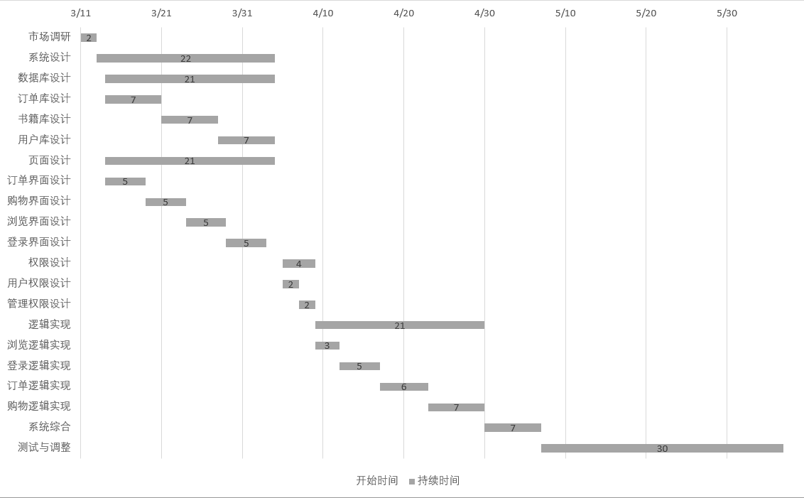

# 2025-5-30会议纪要

## 会议纪要

1.参考教材6.2，结合项目的进程和开发历程，从设计原则的几个方面，组员对负责设计的模块进行评估，思考存在的问题和解决方案。

2.阅读下面DI资料[，]()学习依赖注入技术。

3.论述利斯科夫替换原则（里氏代换原则）、单一职责原则、开闭原则、德（迪）米特法则、依赖倒转原则、合成复用原则，结合自己的实践项目举例说明如何应用

## 主要内容

### 1.对设计原则进行评估

#### 1.1模块化

##### 1.1.1现状分析

    当前模块结构：用户模块，图书模块，购物车、收藏、及订单模块，后台管理模块

##### 1.1.2问题分析

    图书查询与库存交叉依赖，并且用户认证和授权逻辑存在耦合

##### 1.1.3解决方案

    建立更加清晰的模块依赖关系

#### 1.2接口

##### 1.2.1现状分析

    分为用户登录注册接口，用户个人信息接口，图书接口等。

##### 1.2.2问题分析

    前后端参数校验逻辑重复

##### 1.2.3解决方案

    将信息的确认完全交给后端处理，前端不进行多余分析

#### 1.3信息隐蔽

##### 1.3.1现状分析

    对信息的保密程度不够高

##### 1.3.2问题分析

    数据库图书实体直接返回到前端
    
    管理员接口与普通用户接口未完全分离
    
    日志记录包含敏感信息
    
    对于ip未做限制

##### 1.3.3解决方案

    （1）实行分层管理
    
    （2）对敏感消息进行加密

#### 1.4增量式开发

##### 1.4.1现状分析



##### 1.4.2问题分析

    新功能会影响现有功能

##### 1.4.3解决方案

    需要添加接口版本控制

#### 1.5抽象

##### 1.5.1问题分析

系统与数据库交互完全依赖于ORM模型，后端不直接与数据库依靠sql语句交互

##### 1.5.2解决方案

明确ORM模型使用界限

#### 1.6通用性

##### 1.6.1问题分析

    缓存使用随意

##### 1.6.2解决方案

    优化缓存使用方式，限制缓存的使用


### 3.各种原则

#### （1）**里氏代换原则（Liskov Substitution Principle, LSP）**

**定义**：子类对象必须能够替换父类对象，并且保证程序功能不被破坏。
 **核心思想**：继承应该确保子类行为符合父类预期，避免违反多态的初衷。

**在网上书店的应用**：
 假设有一个父类 `User`，子类包括 `Customer`（普通顾客） 和 `Admin`（管理员）。如果 `Admin` 重写了一个方法 `getDiscount()` 并抛出异常或返回错误逻辑，会导致在对 `User` 的统一处理时出错，这就违反了 LSP。

```
class User:
    def get_discount(self):
        return 0

class Customer(User):
    def get_discount(self):
        return 10  # 普通顾客享受折扣

class Admin(User):
    def get_discount(self):
        return 0  # 管理员不享受折扣，但依然兼容父类方法
```

------

#### （2）**单一职责原则（Single Responsibility Principle, SRP）**

**定义**：一个类应该仅有一个引起它变化的原因。
 **核心思想**：类的功能应高度内聚，职责应单一。

**在网上书店的应用**：
 初始版本中，`OrderManager` 既处理订单逻辑，又负责打印订单、发送邮件：

```
# 不符合 SRP
class OrderManager:
    def create_order(self): pass
    def cancel_order(self): pass
    def print_invoice(self): pass
    def send_email(self): pass
```

优化后分成多个类，每个类职责单一：

```
class OrderManager:
    def create_order(self): pass
    def cancel_order(self): pass

class InvoicePrinter:
    def print_invoice(self): pass

class EmailSender:
    def send_email(self): pass
```

------

#### （3）**开闭原则（Open-Closed Principle, OCP）**

**定义**：软件实体（类、模块、函数）应对扩展开放，对修改关闭。
 **核心思想**：通过抽象和多态，在不修改原有代码的基础上进行功能扩展。

**在网上书店的应用**：
 系统最初只支持支付宝支付，后来要扩展微信支付和银行卡支付。

```
# 原始方式：每次都要改 PaymentProcessor
class PaymentProcessor:
    def pay(self, method):
        if method == 'alipay':
            self.alipay()
        elif method == 'wechat':
            self.wechat()
```

改为 OCP 模式：

```
class PaymentMethod:
    def pay(self): pass

class Alipay(PaymentMethod):
    def pay(self): print("支付宝支付")

class WeChatPay(PaymentMethod):
    def pay(self): print("微信支付")

class PaymentProcessor:
    def process(self, method: PaymentMethod):
        method.pay()
```

------

#### （4）**迪米特法则（Law of Demeter, LoD）**

**定义**：一个对象应当对其他对象有尽可能少的了解。
 **核心思想**：降低耦合，避免“传递调用”。

**在网上书店的应用**：
 原始方式，`OrderService` 访问订单的用户并再访问用户的地址：

```
# 违反LoD
order.get_user().get_address().get_city()
```

改为提供必要的中介方法：

```
class Order:
    def get_user_city(self):
        return self.user.get_address().get_city()

# 使用：
order.get_user_city()
```

------

#### （5）**依赖倒转原则（Dependency Inversion Principle, DIP）**

**定义**：高层模块不应该依赖低层模块，二者都应依赖其抽象。抽象不依赖细节，细节依赖抽象。
 **核心思想**：程序要依赖于接口或抽象类，而不是具体类。

**在网上书店的应用**：
 `OrderService` 依赖一个 `Notification` 服务发送消息，初始硬编码为 `EmailSender`：

```
# 违反DIP
class OrderService:
    def notify_user(self):
        email_sender = EmailSender()
        email_sender.send_email()
```

改为依赖抽象：

```
class Notification:
    def send(self): pass

class EmailSender(Notification):
    def send(self): print("发送邮件")

class SMSSender(Notification):
    def send(self): print("发送短信")

class OrderService:
    def __init__(self, notifier: Notification):
        self.notifier = notifier

    def notify_user(self):
        self.notifier.send()
```

------

#### （6）**合成复用原则（Composite Reuse Principle, CRP）**

**定义**：优先使用对象组合，而不是继承，来实现代码复用。
 **核心思想**：组合比继承更灵活、解耦度更高。

**在网上书店的应用**：
 错误做法：让 `OrderPrinter` 继承 `Order`，只是为了打印订单信息。

```
# 不推荐继承仅为复用
class OrderPrinter(Order):
    def print(self): pass
```

正确方式：通过组合实现：

```
class OrderPrinter:
    def __init__(self, order: Order):
        self.order = order

    def print(self):
        print(f"订单编号: {self.order.id}")
```


