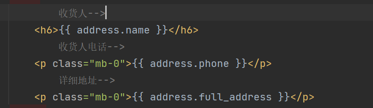
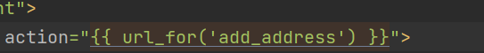

# TodoList

* [X] 登录后，跳转index.html不能正常获取books

- [ ] 登录后购物车正常链接的问题，没有提供book_list的信息，需要添加

- [x] 注册界面需要添加返回性别，返回格式：sex={1，2}  # 1 = 男 ，2 = 女 

- [ ] 个人中心的接口，102行，使用adress命名，接受

- [ ] 

  162行，html提供收货人，联系电话，详细地址，存储到数据库中，

