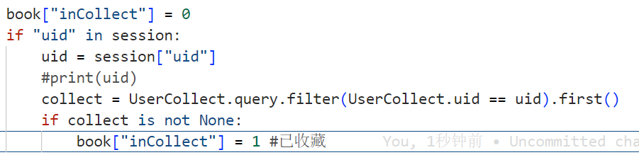

# TodoList

* [X] 目前个人中心收藏界面已经能够获取数据，但目前展示格式仍有问题，问题如下：
  1.建议改为横行表格排列，即一个块占用全部的一行，避免产生书名或时间的字符串中间换行
  2.整更好看一点
* [ ] 个人中心个人地址不能编辑或删除
* [X] 登录时没有检查用户名正确性，如果传入错误用户名将会返回错误
* [ ] 前段网页格式优化
* [X] update_profile()小bug：未检查重复用户名
* [X] 购物车收藏的后端数据返回
* [X] 添加了退出函数用来注销用户登录状态，url：/user/logout
* [X] 获取图书详情页面BookDetails函数添加了返回数据中属性“inCollect”，标记是否已收藏

  
* [X] 登录后，跳转index.html不能正常获取books

- [X] 登录后购物车正常链接的问题，没有提供book_list的信息，需要添加
- [X] 注册界面需要添加返回性别，返回格式：sex={1，2}  # 1 = 男 ，2 = 女
- [X] 个人中心的接口，102行，使用adress命名，接受
- [X] 

  162行，html提供收货人，联系电话，详细地址，存储到数据库中，
